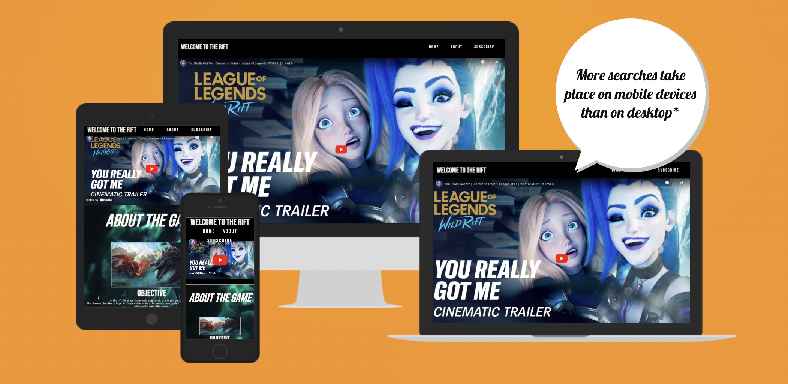
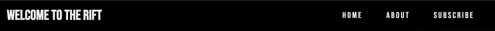
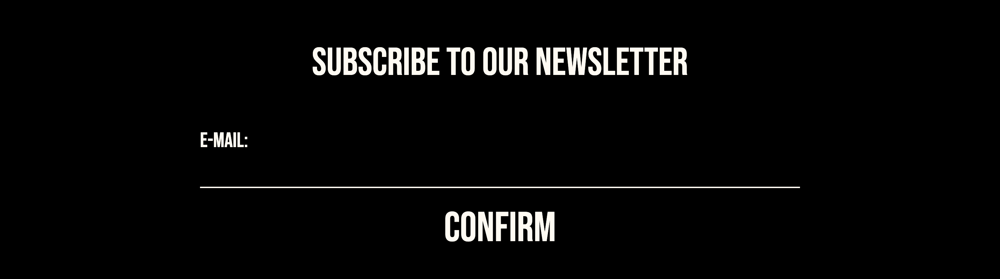
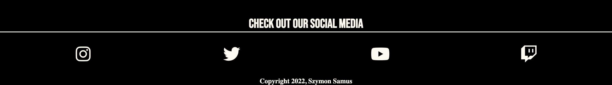
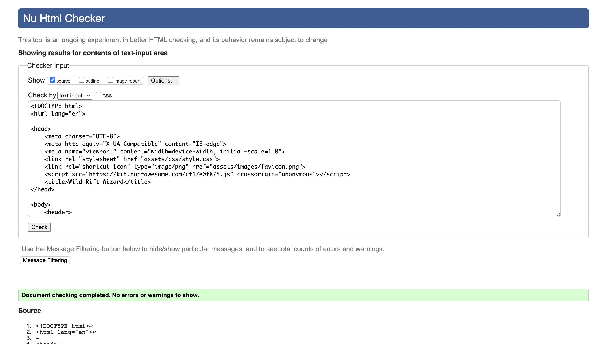
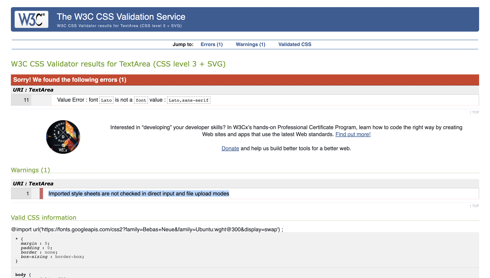
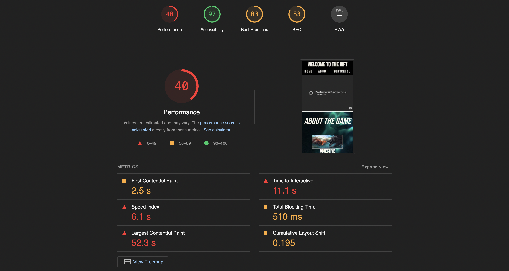

# WELCOME TO THE WILD RIFT

Wild Rift is a website designed to draw users to the MOBA goliath League of Legends: Wild Rift through flashy imagery and exciting trailer videos.

The website is structured into 3 segments:
- The a intro video which is the first thing the user sees upon entering the website, designed to keep the user attention.
- The about section which explains the game mechanics and structure more to the user.
- The footer section, which is a section where potential players can request information through a subscribe form and access social media presence.

The Design of the Webpage:
- The design of the webpage is made to be more appealing to a video game enthusiast, with a bold/clear color contrast, clean structure and flashy imagery.

To view the deployed project [click here.](https://sizimon.github.io/project-one-ci/)

## UXD:

Website intentions:

 The Intention of the website is to bring and intriguing page to the user, at the same time showing what the product has to offer.

### FOR THE USER: 
 A clear, structured experience into discovering content about the game.
 Simple but flashy content used to show the user what they can expect from the game.
 Create joy and excitement for the user that visits the page.

### FOR THE DEVELOPER:
 To portray the personality of the game inline with the webpage.
 Provide solid information about the games core details.
 Attempt to get the user to try out the game.

## Process:

- The site employs a B2C structure, and thus needs structured information and compelling content in order to convice the customer to try the product.

- It has a more electric design, clearly catering in the direction to the gaming community, the color contrast is bold and clearly visible, designed to keep the user reading, using imaged and videos where needed to keep attention.

- The structure on the web page is simple, a large informational video will be the first thing the user sees, followed by an informational area, in turn followed by subscriber content and social media.

- Design will be spearheaded by two fonts that work great with eachother, and a simple but clearly effective color scheme which will keep the user reading.

## PAGE FEATURES:

### HEADER/NAV:
The Navigation Area consists of a main logo which also serves as a home button, and also 3 navigational on the right side of the navigation bar, these navigational links will take you to the relevant parts of the page. 

### MAIN VIDEO:
This is the main page video, it is the first thing people see, and is designed to keep the users interest in the webpage locked in. The Size of the video is consistant on different screen sizes.

### ABOUT SECTION: 
On Larger screen sizes the about section is organised almost as 2 small about sections, with the first having images aligned left and content on the right, with the second being reversed, this adds some dynamic to the webpage and helps us to keep the user experience expectations flowing. On smaller devices it follows the standard top down flow. 

### SIGN UP FORM:
A simple subscribe form to get the user to enter their email if they would like to subscribe for content about the game, the styling on the form matches the way the webpage flows and keeps the website styling flowing without compromise.

### SOCIAL MEDIA:
4 relevant social media icons used to link directly to the game page we are trying to advertise, the links are relevant to the customer we are expecting, with links to such platforms as twitch. The style again is clearly following the structure of the webpage and keeps the page flowing.

## DESIGN CHANGES:
The initial skeleton I was hoping to end up with was roughly the same as my end product, however the about section was structured in a top down block format on all screen sizes, I decided to change that on larger screen sizes to fill the space a little more. 

### FUTURE FEATURES: 
To add related app store/google store badge download links.

## TESTING: 

## HTML:
My code initially did not pass the validator because of a random DIV closing tag, this was fixed and the code passed without a problem.

## CSS:
My code here also had problems, since I reused IDs a lot. This was fixed and assigned classes instead to repeated rules, now I have no significant errors, just an error to do with an import.

## LIGHTHOUSE:
My lighthouse performance score is a little low, I believe that is due to the @media queries and the fact that I have youtube iframes and a large sized background photo.

## BUGS:
I had problems with the responsiveness on my site, I watched a few videos which told to use flexbox for my structuring to make this easier, however it was too late to change design to flexbox so a lot of media queries were used to help responsiveness on my site, this resulted in having to change a lot of height-width value to use more responsive sizing, such as VH/VW and REM/EM.

# SITE DEPLOYMENT:
The site was created on GitPod first, then deployed by GitHub Pages, to deploy the site:
- In git hub repository, click settings.
- On the navigation bar, click pages.
- Change drop down menu in branch to main.
- Once Deployed it will display a link to the site.

# CREDITS:

## CONTENT:

### MEDIA:

All media images used for the project:
https://wallpapers.com/images/file/blue-victory-league-of-legends-tw08d3v88qcx65au.jpg
https://images3.alphacoders.com/121/1219362.jpg
https://static.wikia.nocookie.net/leagueoflegends/images/5/53/Summoner%27s_Rift_Update_Map.png/revision/latest?cb=20170223053555
https://images.contentstack.io/v3/assets/blt370612131b6e0756/blt4f18c4d051c1be3a/62b2715b36119858583d1992/07-08-2022_Elemental-Rift_Overview_Banner.jpg

Video sources:
https://www.youtube.com/watch?v=TFzkbos0oeo

### CODE:

Some code was helped by the love running header section video.  
Favicon was installed with the help from [here](https://www.youtube.com/watch?v=kEf1xSwX5D8).
